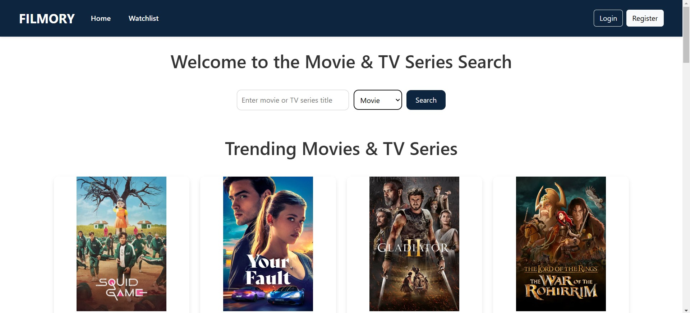
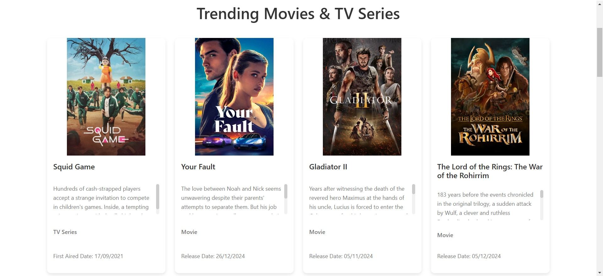
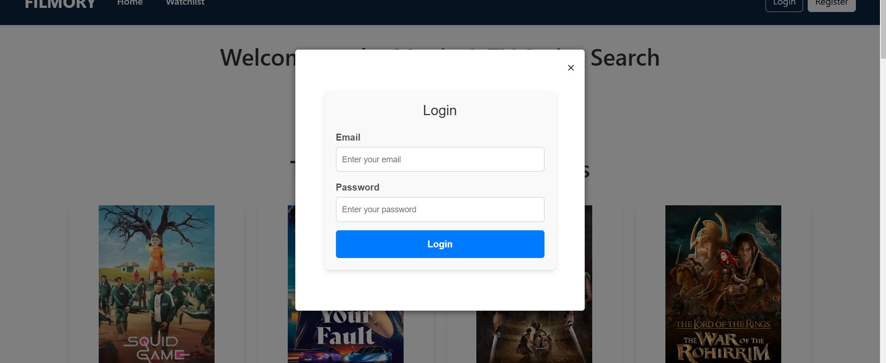
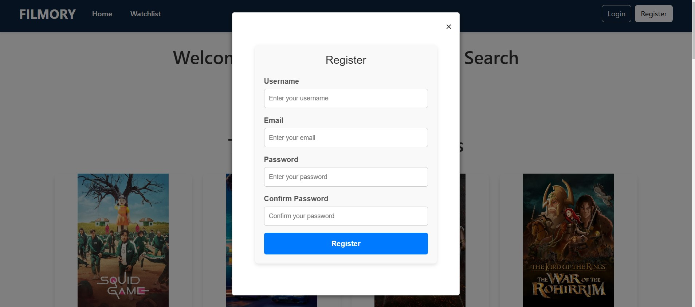
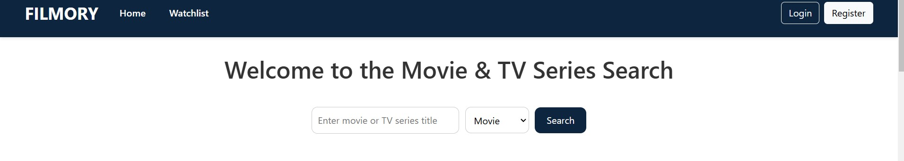
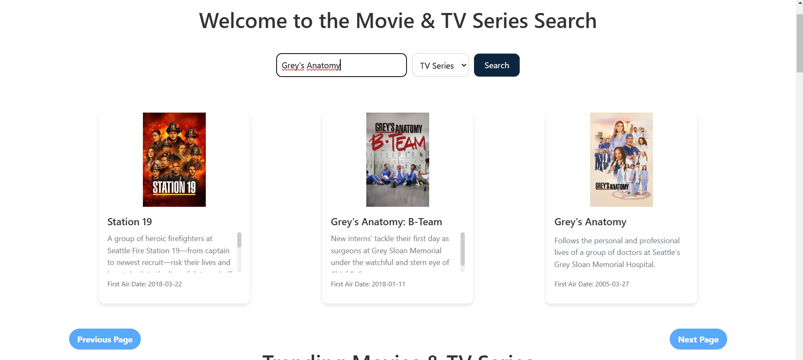
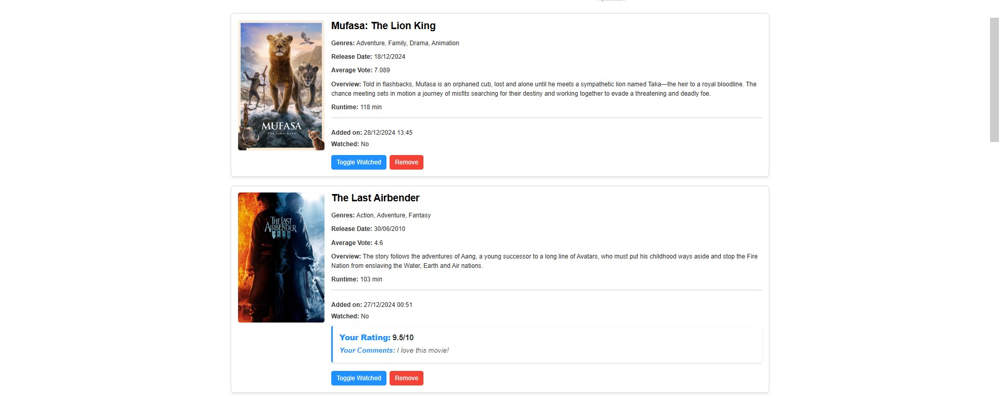
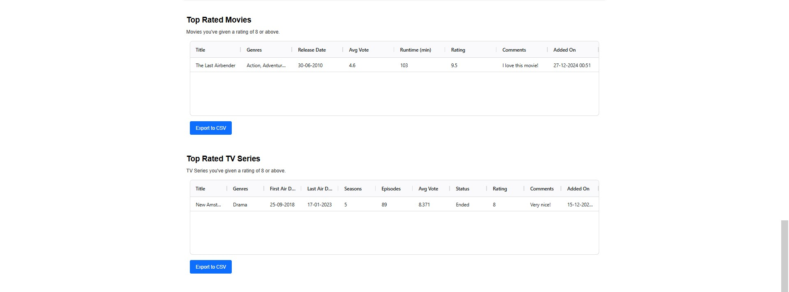

# Project Overview

## Application: Filmory
Filmory is a comprehensive web application tailored for movie and TV series enthusiasts. It allows users to explore trending content, search for their favorite titles, and maintain a personalized watchlist with advanced features.

---

## Features

### Backend
- **Movie and Series Endpoints**: Provides routes to retrieve trending data, perform searches, and manage personalized watchlists.
- **User Authentication**: Includes secure login and registration, powered by middleware validation.
- **Database Integration**: Seamlessly stores watchlist and user data in a PostgreSQL database.
- **TMDB API Integration**: Fetches real-time movie and series details from The Movie Database (TMDB).

### Frontend
- **Secure Authentication**: Offers a user-friendly login and registration flow.
- **Comprehensive Search**: Enables searching for movies and TV series through TMDB's extensive catalog.
- **Watchlist Management**: Users can add, remove, rate, and comment on their saved items.
- **Data Visualization**: Provides insights into user preferences with charts and tables.

---

## Pages Overview

### 1. **Home Page**
#### Description:
The homepage presents a clean, modern interface showcasing trending movies and TV series, along with an integrated search bar for quick access to the content users love.
#### Screenshot:



---

### 2. **Login Page**
#### Description:
Allows users to log in securely, providing access to their personalized watchlist and other features.
#### Screenshot:


---

### 3. **Registration Page**
#### Description:
New users can easily create accounts by entering their details, ensuring a seamless onboarding experience.
#### Screenshot:


---

### 4. **Search Bar**
#### Description:
Users can search for movies and TV series using keywords. The results include detailed information such as title, synopsis, release date, or the premiere date of the first episode.
#### Screenshot:



---

### 5. **Watchlist Page**
#### Description:
Users can view their personalized watchlist with options to:
- Remove items.
- Mark items as "watched," and then add ratings and comments.
#### Screenshot:


---

### 6. **Analytics (inside Watchlist Page)**
#### Description:
This page offers:
- Bar charts to visualize watchlist statistics, such as the proportion of movies vs. TV series.
- Ag-grid tables showcasing top-rated content (rated 8 or higher).
#### Screenshot:



---

## User Guide

### Getting Started

#### Clone the Repository
```bash
git clone https://github.com/alexquilis1/Filmory.git
```

#### Install Dependencies
- Backend:
```bash
cd movies/backend
npm install
```
- Frontend:
```bash
cd movies/frontend
npm install
```

#### Database Setup
1. Create a PostgreSQL database named `movie_series_watchlist`.
2. Run the `create_tables.sql` script to set up the necessary database schema.
3. Ensure your PostgreSQL instance is configured with the following default settings:
   - User: postgres
   - Password: root (update if necessary)
   - Host: localhost
   - Port: 5432 (default PostgreSQL port)
  
**Note: If your PostgreSQL setup uses a different user, password, host, or port, make sure to update these details in the backend configuration file before running the project.**

#### Run the Application
- Backend:
```bash
npm start
```
- Frontend:
```bash
ng serve
```

#### Access the Application
- Swagger Documentation: `http://localhost:3000/api-docs`
- Frontend: `http://localhost:4200`

---

### User Actions

#### Log In or Register
1. Navigate to the login page.
2. Enter your credentials or register for a new account by completing the registration form.

#### Search for Movies and TV Series
1. Use the search bar on the homepage to find content.
2. Enter a keyword, choose if you're searching for a Movie or a TV series, and click "Search" to view results with detailed information.

#### Manage Your Watchlist
1. Add items to your watchlist from the search results or trending sections (available when logged in).
2. Visit the watchlist page to:
   - Remove items.
   - Mark them as "watched," and then rate and comment on your favorites.

#### Analyze Your Watchlist
1. Navigate to the "analytics section" on the watchlist page.
2. View bar charts and tables showcasing:
   - Distribution of movies vs. TV series.
   - Top-rated content based on your ratings.

---
